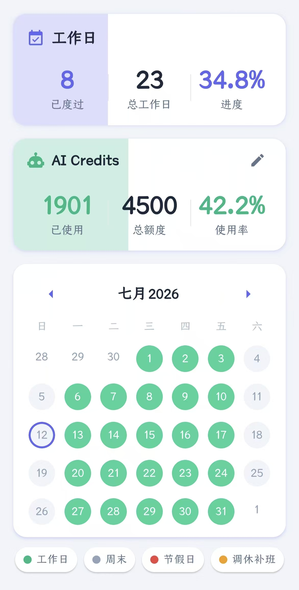

# AI Pace

> Keep your AI credit usage in sync with your workday progress.

**AI Pace（AI 配速）** 是一个帮助 AI 用量敏感型用户管理 **AI Credits** 的应用。

它会自动计算当前月份 **工作日进度**，并与你设置的 **AI Credits
使用进度** 进行实时对比，让你始终知道自己的 AI 使用节奏是否合理。

------------------------------------------------------------------------

## ✨ Features

-   📅 自动获取每个月份的工作日（智能节假日/调休）
-   📈 显示工作日进度百分比
-   🤖 手动记录 AI Credits 总额度与已使用额度（后续可能增加自动获取功能）
-   ⚖️ 直观对比工作进度与 AI 使用进度
-   🗓️ 内置工作日日历，可手动设置请假/加班（但**不会支持**自动按照大小周、单休、996进行设置，**这种病态的工时模式不应当被推广**）
-   🎨 简洁直观的 Material Design 风格界面

------------------------------------------------------------------------

## 💡 Why AI Pace?

许多 AI 服务（Claude、GitHub Copilot 等）都采用按月额度的计费方式。

**AI Pace 旨在帮助你更直观、精准地了解本月的工作日已经过完了多少**

例如：对于2026年7月12日，**看似**7月已经度过了将近**半个月**，但**实际上**工作日只度过了8/23，才刚过**三分之一**！

这样，你**无需对着日历心算**，只需要打开 App 看一眼即可。

------------------------------------------------------------------------

## 📱 Screenshot



------------------------------------------------------------------------

## 🚀 Tech Stack

-   React Native
-   Expo
-   TypeScript
-   React Navigation

------------------------------------------------------------------------

## 📦 Installation

``` bash
git clone https://github.com/<your-name>/ai-pace.git

cd ai-pace

npm install

npx expo start
```

------------------------------------------------------------------------

## 🤝 Contributing

欢迎提交 Issue 和 Pull Request。

如果这个项目对你有帮助，欢迎点一个 ⭐。

------------------------------------------------------------------------

## License

MIT License
